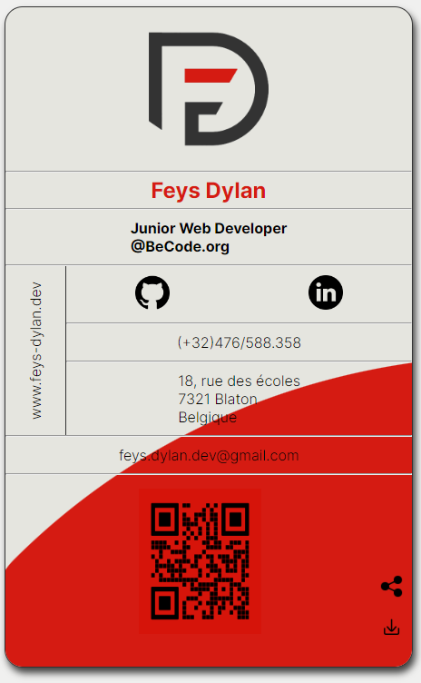

# v-card

## Description

Tout premier projet de la formation BeCode.
Réalisation d'une carte de visite à réaliser en HTML en essayant d'avoir la meilleur sémantique possible, et en CSS. 

## Learning Ojective

- Créer une carte de visite en HTML et CSS
- Utiliser des techniques de positionnement comme grid ou flexbox
- Créer et utiliser un wireframe si besoin

## Screenshot

## Github Page

https://happyfeys.github.io/v-card/